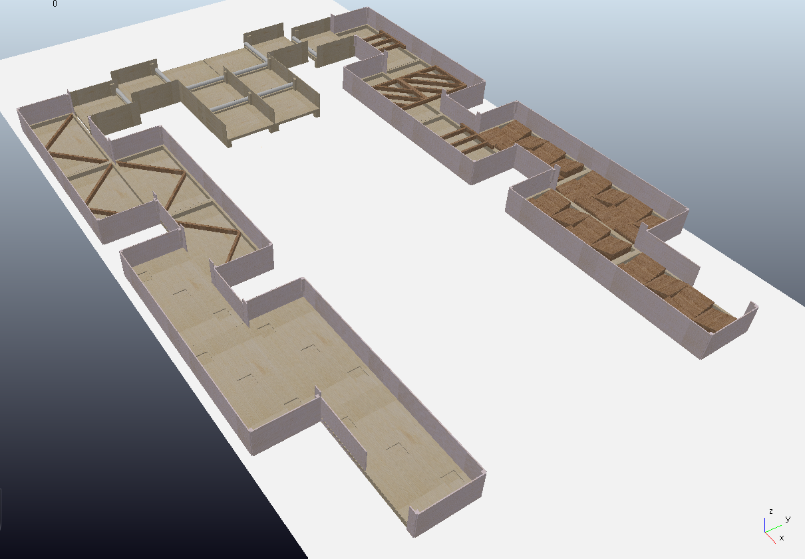
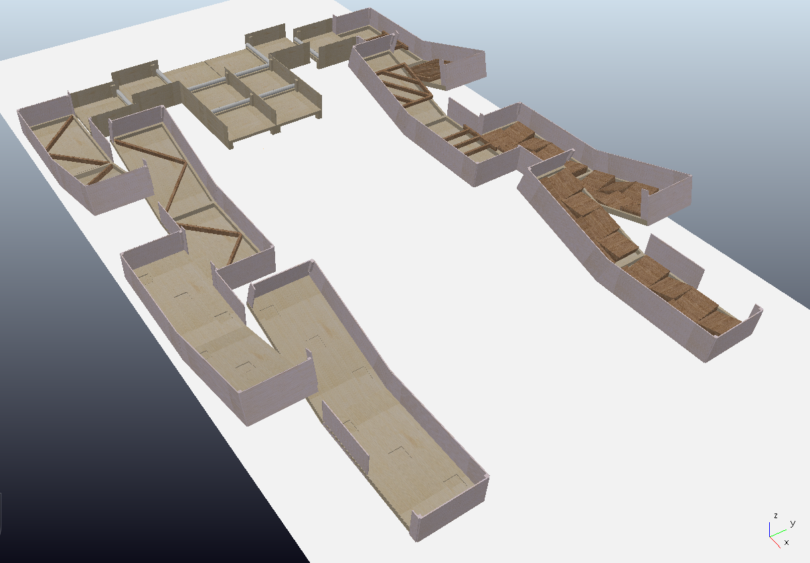

# ICRA 2024 quadruped competition simulation map

- Version 1.0.0
[](https://2024.ieee-icra.org/)
---

<div style="display:flex;">
<div style="flex:50%; padding-right:10px; border-right: 1px solid #dcdde1">

**Package summary**

This repository provides a simulation map file for the ICRA2024 QRC competition. 

- Maintainer status: maintained
- Maintainers
  - Jeongmin Jeon (nicky707@g.skku.edu)
  - Hyungpil Moon (hyungpil@g.skku.edu)
- Author
  - Jeongmin Jeon (nicky707@g.skku.edu)


</div>
<div style="flex:40%; padding-left:10px;">

**Table of Contents**
- [Overview](#overview)
- [Installation methods](#installation-methods)
    - [1. ROS](#1-ros)
    - [2. Dependencies](#2-dependencies)
    - [3. Gazebo](#3-gazebo)
    - [4. Tutorial](#4-tutorial)

</div>
</div>

---

## Overview


|          |            |
|----------|------------|
| flat ver | sloped ver |

- A repository for ICRA2024 Quadruped Robot Challenges. Used for build, test, and deployment.
- This repository provides a urdf map file and provides tutorial for importing it from the gazebo simulator with ROS.

---

## Installation methods

- In this tutorial, we only provide a method to import the urdf map file from gazebo simulator with ROS. 
- If you want to use another simulator, import `urdf/map_flat.urdf` and `urdf/map_sloped.urdf` directly

#### 1. ROS

Tested on ros-melodic and ros-noetic versions. [ROS Install](http://wiki.ros.org/melodic/Installation/Ubuntu)

#### 2. Dependencies

```bash
sudo apt-get install ros-$ROS_DISTRO-xacro ros-$ROS_DISTRO-urdf ros-$ROS_DISTRO-urdf-tutorial
sudo apt-get install ros-$ROS_DISTRO-joint-state-publisher
```

#### 3. Gazebo

```bash
sudo apt-get install ros-$ROS_DISTRO-gazebo-ros-pkgs ros-$ROS_DISTRO-gazebo-ros-control
```


#### 4. Usage
clone the URDF package 
```bash
cd $ROS_WORKSPACE
mkdir src
cd src
git clone https://github.com/rise-lab-skku/ICRA2024_Quadruped_Competition
```

build & install
```bash
cd ..
catkin_make
```


import urdf environment from gazebo
```bash
roslaunch ICRA2024_Quadruped_Competition gazebo_world.launch 
```

You can use the launch argument to choose map difficulty.
```bash
roslaunch ICRA2024_Quadruped_Competition gazebo_world.launch map:=flat # or sloped
```

